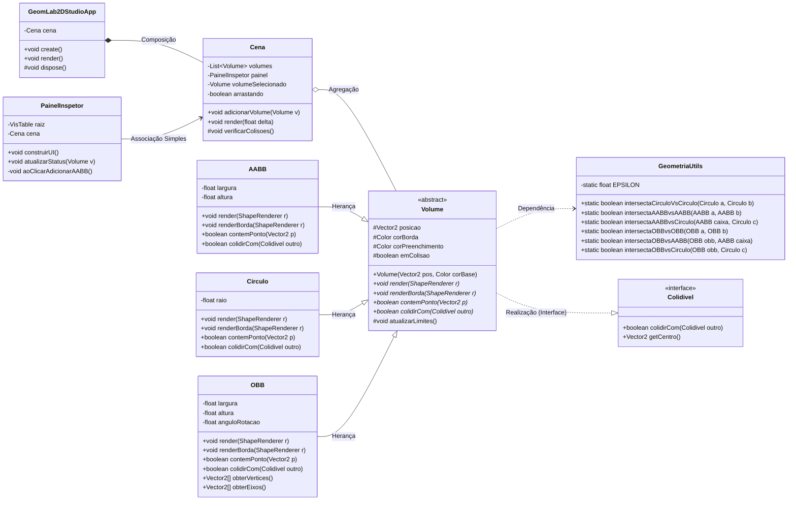

# 📐 Especificação Arquitetural — GeomLab 2D Studio

## 1. Visão Geral

O sistema segue uma arquitetura de **Composição de Tela** típica do LibGDX, separando claramente:

- **Camada de Apresentação** — `GeomLab2DStudioApp` (ciclo de vida da aplicação)
- **Camada de Cena** — `Cena` (orquestra o estado do mundo geométrico)
- **Camada de UI** — `PainelInspetor` (VisUI / Scene2D)
- **Camada de Domínio Geométrico** (pacote `com.geomlab.studio.geometry`) — `Volume` (abstração polimórfica), `AABB`, `Circulo`, `OBB`
- **Camada de Contrato** — `Colidivel` (interface)
- **Camada Utilitária** — `GeometriaUtils` (funções matemáticas puras, *stateless*)

> **Decisão de arquitetura:** o projeto não utiliza motores de física (ex: Box2D). Usa apenas as primitivas matemáticas do `com.badlogic.gdx.math` (`Vector2`, `MathUtils`) como base aritmética, implementando seus próprios algoritmos de detecção de colisão em `GeometriaUtils`. Isso preserva a clareza didática do polimorfismo via `Colidivel` e a genuinidade da classe utilitária exigida pelo projeto.

> **Decisão de renderização:** `Volume.render()` usa `ShapeRenderer` (geometria vetorial), não `SpriteBatch` (sprites/texturas). O desenho é feito em **duas passadas por frame**: `render()` (preenchimento translúcido) e `renderBorda()` (contorno sólido, desenhado por cima de todos os preenchimentos) — isso evita que formas sobrepostas se ocultem totalmente umas às outras.

---

## 2. Justificativa do Polimorfismo (`Volume`)

A superclasse abstrata `Volume` permite que `Cena` mantenha uma única coleção `List<Volume>` contendo `AABB`, `Circulo` e `OBB` simultaneamente, sem precisar de `if/else instanceof` espalhado pelo código. Os métodos `render(ShapeRenderer)`, `renderBorda(ShapeRenderer)` e `colidirCom(Colidivel)` são despachados dinamicamente (*dynamic dispatch*): cada subclasse decide como se desenha e como testa colisão, mas a `Cena` chama todos de forma uniforme:

```java
for (Volume v : volumes) v.render(shapeRenderer);
```

Isso aplica o **Princípio Aberto/Fechado**: novas formas (ex: `Poligono`) podem ser adicionadas sem alterar `Cena`.

---

## 3. Diagrama de Classes UML



---

## 4. Chamadas Polimórficas no Ciclo de Vida do `render()`

Dentro de `Cena.render(float delta)`:

```java
private void desenharVolumes() {
    shapeRenderer.setProjectionMatrix(stage.getCamera().combined);
    Gdx.gl.glEnable(GL20.GL_BLEND);
    Gdx.gl.glBlendFunc(GL20.GL_SRC_ALPHA, GL20.GL_ONE_MINUS_SRC_ALPHA);

    shapeRenderer.begin(ShapeRenderer.ShapeType.Filled);
    for (Volume v : volumes) {
        v.render(shapeRenderer);       // (1) Despacho dinâmico: preenchimento translúcido
    }
    shapeRenderer.end();

    shapeRenderer.begin(ShapeRenderer.ShapeType.Line);
    for (Volume v : volumes) {
        v.renderBorda(shapeRenderer);  // (2) Despacho dinâmico: contorno sólido, por cima de tudo
    }
    shapeRenderer.end();
}

protected void verificarColisoes() {
    for (Volume v : volumes) {
        v.setEmColisao(false);
    }
    for (int i = 0; i < volumes.size(); i++) {
        for (int j = i + 1; j < volumes.size(); j++) {
            Volume a = volumes.get(i);
            Volume b = volumes.get(j);
            if (a.colidirCom(b)) {       // (3) Despacho dinâmico via interface Colidivel
                a.setEmColisao(true);
                b.setEmColisao(true);
            }
        }
    }
}
```

Cada uma das três chamadas (`v.render()`, `v.renderBorda()`, `a.colidirCom(b)`) é resolvida **em tempo de execução**, conforme o tipo concreto real do objeto (`AABB`, `Circulo` ou `OBB`) — sem nenhum `instanceof` no lado de `Cena`.

> **Estado de colisão por forma:** `emColisao` é um booleano por `Volume`, resetado e recalculado a cada frame. Isso suporta qualquer quantidade de colisões simultâneas (3+ formas sobrepostas ao mesmo tempo) sem ambiguidade — não há necessidade de rastrear "cor por par", apenas "esta forma está, neste frame, tocando alguém?".

---

## 5. Motor de Colisão — 6 Pares Implementados em `GeometriaUtils`

| Par | Técnica | Resumo |
|---|---|---|
| Círculo × Círculo | Distância ao quadrado | `distância² ≤ (somaRaios)²` |
| AABB × AABB | Sobreposição de intervalos | Colide se há overlap simultâneo nos eixos X e Y |
| AABB × Círculo | Clamping | Centro do círculo é restringido aos limites do AABB; testa distância do ponto resultante ao raio |
| OBB × OBB | SAT (Separating Axis Theorem) | Projeta vértices nos 4 eixos (2 de cada OBB); se algum eixo separa as sombras, não colide |
| OBB × AABB | SAT | Mesma lógica, tratando o AABB como um "OBB" de eixos fixos (1,0) e (0,1) |
| OBB × Círculo | Clamping no espaço local | Centro do círculo é rotacionado para o referencial local do OBB, então clampado como um AABB comum |

---

## 6. Matriz de Auditoria POO

| # | Regra | Classe(s) Exata(s) no Diagrama | Evidência |
|---|---|---|---|
| 1 | ≥ 7 classes no ecossistema | `GeomLab2DStudioApp`, `Cena`, `PainelInspetor`, `Colidivel`, `Volume`, `AABB`, `Circulo`, `OBB`, `GeometriaUtils` | 9 classes/tipos declarados |
| 2 | Superclasse abstrata + 3 heranças genuínas | `Volume` ← `AABB`, `Circulo`, `OBB` | Setas `--\|>` no diagrama |
| 3a | Associação Simples | `PainelInspetor --> Cena` | `PainelInspetor` chama métodos de `Cena` sem possuí-la |
| 3b | Dependência | `Volume ..> GeometriaUtils` | `AABB`/`Circulo`/`OBB.colidirCom()` usam métodos utilitários sem manter referência |
| 3c | Agregação | `Cena o-- Volume` | `Cena` mantém `List<Volume>`, mas os volumes podem existir independentemente |
| 3d | Composição | `GeomLab2DStudioApp *-- Cena` | Ciclo de vida da `Cena` é totalmente dependente de `GeomLab2DStudioApp` |
| 4a | Interface (abstração 1) | `Colidivel` | `<<interface>>` com `colidirCom()` e `getCentro()` |
| 4b | Classe Abstrata (abstração 2) | `Volume` | `<<abstract>>` com `render`, `renderBorda`, `contemPonto`, `colidirCom` marcados `*` |
| 5 | 3 chamadas polimórficas no render() | `Cena` (métodos `desenharVolumes` e `verificarColisoes`) | `v.render(shapeRenderer)`, `v.renderBorda(shapeRenderer)`, `a.colidirCom(b)` |
| 6 | Modificadores `+` / `#` / `-` | `Volume` (`#posicao`, `#emColisao`), `GeomLab2DStudioApp` (`#dispose`), `Volume` (`+render`), `AABB` (`-largura`) | Presentes em todas as classes do domínio |
| 7 | 1 atributo estático + 1 método estático | `GeometriaUtils` | `-static float EPSILON` / 6 métodos `+static boolean intersecta...(...)` |

---

## 7. Roadmap de Desenvolvimento

| Etapa | Nome | Entregável Visível | Foco POO | Status |
|---|---|---|---|---|
| 1 | Fundação e Esqueleto Visual | Janela LibGDX abre, divisão 30/70 (Inspetor/Canvas) renderizada com VisUI | Estrutura de classes, Composição (`App *-- Cena`) | ✅ Concluída |
| 2 | Domínio Geométrico (Volume) | `Volume`, `AABB`, `Circulo`, `OBB` desenhando-se no Canvas via clique do Inspetor | Herança, Abstração, Polimorfismo no `render()` | ✅ Concluída |
| 3 | Interatividade e Manipulação | Arrastar/mover formas no Canvas com mouse, sincronizado com o Inspetor; "trazer para frente" ao selecionar | Associação, Encapsulamento | ✅ Concluída |
| 4 | Motor de Colisão | 6 pares de colisão (SAT + clamping) com feedback visual (cor de alerta), suportando colisões simultâneas múltiplas | Interface `Colidivel`, Dependência (`GeometriaUtils`), Agregação, atributo/método estático | ✅ Concluída |
| 5 | Polimento e Persistência | Painel completo, salvar/carregar cena (JSON), métricas estáticas | Atributo/Método estático, refino dos modificadores de visibilidade | 🔜 Próxima |
| 6 | Nuvens de Pontos e Encapsulamento Mínimo | Geração de pontos numa área + cálculo da menor primitiva que cubra todos eles; recoloração dinâmica de pontos que saiam da forma ao arrastá-la | Reaproveitamento de `GeometriaUtils`, novo método polimórfico "contémPonto" em `Volume` | ⏳ Planejada (depende das Etapas 3 e 4) |

> **Nota de escopo (Etapa 6):** o problema de "menor forma que cubra a maior quantidade possível de pontos" foi deliberadamente simplificado para o problema clássico de **Minimum Enclosing Shape** — a menor primitiva que cubra **todos** os pontos da nuvem, sem rejeição de outliers. A versão com rejeição de outliers (mais próxima de RANSAC/*trimmed estimators*) é um problema de otimização mais complexo e foi descartada para manter o foco didático em POO, não em algoritmos de otimização geométrica.

---

## 8. Ambiente de Desenvolvimento

| Item | Configuração |
|---|---|
| Ferramenta de setup | LibGDX Setup UI (`gdx-setup.jar`) |
| Package raiz | `com.geomlab.studio` |
| Pacote do domínio geométrico | `com.geomlab.studio.geometry` |
| Game class | `GeomLab2DStudioApp` |
| Sub-projetos | `core` + `lwjgl3` (Desktop) |
| Extensão de terceiros | VisUI (Kotcrab) — `com.kotcrab.vis:vis-ui:1.5.3` |
| IDE | Eclipse (via plugin Buildship/Gradle) |