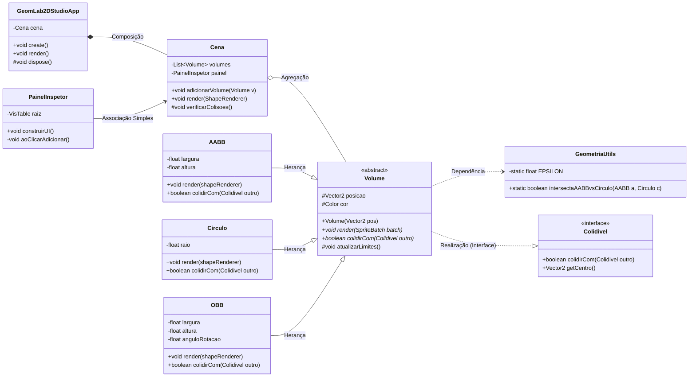

# 📐 Especificação Arquitetural — GeomLab 2D Studio

## 1. Visão Geral

O sistema segue uma arquitetura de **Composição de Tela** típica do LibGDX, separando claramente:

- **Camada de Apresentação** — `GeomLab2DStudioApp` (ciclo de vida da aplicação)
- **Camada de Cena** — `Cena` (orquestra o estado do mundo geométrico)
- **Camada de UI** — `PainelInspetor` (VisUI / Scene2D)
- **Camada de Domínio Geométrico** — `Volume` (abstração polimórfica), `AABB`, `Circulo`, `OBB`
- **Camada de Contrato** — `Colidivel` (interface)
- **Camada Utilitária** — `GeometriaUtils` (funções matemáticas puras, *stateless*)

> **Decisão de arquitetura:** o projeto não utiliza motores de física (ex: Box2D). Usa apenas as primitivas matemáticas do `com.badlogic.gdx.math` (`Vector2`, `MathUtils`) como base aritmética, implementando seus próprios algoritmos de detecção de colisão em `GeometriaUtils`. Isso preserva a clareza didática do polimorfismo via `Colidivel` e a genuinidade da classe utilitária exigida pelo projeto.

---

## 2. Justificativa do Polimorfismo (`Volume`)

A superclasse abstrata `Volume` permite que `Cena` mantenha uma única coleção `List<Volume>` contendo `AABB`, `Circulo` e `OBB` simultaneamente, sem precisar de `if/else instanceof` espalhado pelo código. O método `render(ShapeRenderer)` é despachado dinamicamente (*dynamic dispatch*): cada subclasse desenha sua própria geometria (retângulo, círculo ou retângulo rotacionado), mas a `Cena` chama todos de forma uniforme:

```java
for (Volume v : volumes) v.render(shapeRenderer);
```

Isso aplica o **Princípio Aberto/Fechado**: novas formas (ex: `Poligono`) podem ser adicionadas sem alterar `Cena`.

---

## 3. Diagrama de Classes UML



---

## 4. Chamadas Polimórficas no Ciclo de Vida do `render()`

Dentro de `Cena.render(shapeRenderer)`:

```java
private void desenharVolumes() {
        shapeRenderer.setProjectionMatrix(stage.getCamera().combined);
        shapeRenderer.begin(ShapeRenderer.ShapeType.Filled);
        for (Volume v : volumes) {
            v.render(shapeRenderer); // chamada polimórfica: AABB, Circulo ou OBB
        }
        shapeRenderer.end();
    }

protected void verificarColisoes() {
    for (int i = 0; i < volumes.size(); i++) {
        for (int j = i + 1; j < volumes.size(); j++) {
            Volume a = volumes.get(i);
            Volume b = volumes.get(j);
            boolean colidiu = a.colidirCom(b);   // (2) Polimorfismo via interface Colidivel
            if (colidiu) {
                a.colidirCom(b);                 // (3) Mesma chamada reaproveitada com tipos concretos distintos em runtime
            }
        }
    }
}
```

Cada chamada `v.render()` e `a.colidirCom(b)` é resolvida **em tempo de execução**, conforme o tipo concreto real do objeto (`AABB`, `Circulo` ou `OBB`).

---

## 5. Matriz de Auditoria POO

| # | Regra | Classe(s) Exata(s) no Diagrama | Evidência |
|---|---|---|---|
| 1 | ≥ 7 classes no ecossistema | `GeomLab2DStudioApp`, `Cena`, `PainelInspetor`, `Colidivel`, `Volume`, `AABB`, `Circulo`, `OBB`, `GeometriaUtils` | 9 classes/tipos declarados |
| 2 | Superclasse abstrata + 3 heranças genuínas | `Volume` ← `AABB`, `Circulo`, `OBB` | Setas `--\|>` no diagrama |
| 3a | Associação Simples | `PainelInspetor --> Cena` | `PainelInspetor` chama métodos de `Cena` sem possuí-la |
| 3b | Dependência | `Volume ..> GeometriaUtils` | `Volume`/subclasses usam métodos utilitários sem manter referência |
| 3c | Agregação | `Cena o-- Volume` | `Cena` mantém `List<Volume>`, mas os volumes podem existir independentemente |
| 3d | Composição | `GeomLab2DStudioApp *-- Cena` | Ciclo de vida da `Cena` é totalmente dependente de `GeomLab2DStudioApp` |
| 4a | Interface (abstração 1) | `Colidivel` | `<<interface>>` com `colidirCom()` e `getCentro()` |
| 4b | Classe Abstrata (abstração 2) | `Volume` | `<<abstract>>` com métodos marcados `*` |
| 5 | 3 chamadas polimórficas no render() | `Cena` (métodos `render` e `verificarColisoes`) | `v.render(shapeRenderer)`, `a.colidirCom(b)` (2x) |
| 6 | Modificadores `+` / `#` / `-` | `Volume` (`#posicao`), `GeomLab2DStudioApp` (`#dispose`), `Volume` (`+render`), `AABB` (`-largura`) | Presentes em todas as classes do domínio |
| 7 | 1 atributo estático + 1 método estático | `GeometriaUtils` | `-static float EPSILON` / `+static boolean intersectaAABBvsCirculo(...)` |

---

## 6. Roadmap de Desenvolvimento

| Etapa | Nome | Entregável Visível | Foco POO | Status |
|---|---|---|---|---|
| 1 | Fundação e Esqueleto Visual | Janela LibGDX abre, divisão 30/70 (Inspetor/Canvas) renderizada com VisUI | Estrutura de classes, Composição (`App *-- Cena`) | ✅ Concluída |
| 2 | Domínio Geométrico (Volume) | `Volume`, `AABB`, `Circulo`, `OBB` desenhando-se no Canvas via clique do Inspetor | Herança, Abstração, Polimorfismo no `render()` | 🔜 Próxima |
| 3 | Interatividade e Manipulação | Arrastar/mover formas no Canvas com mouse, sincronizado com o Inspetor | Associação, Encapsulamento | ⏳ Planejada |
| 4 | Motor de Colisão | Detecção de colisão entre quaisquer 2 formas, com feedback visual | Interface `Colidivel`, Dependência (`GeometriaUtils`), Agregação | ⏳ Planejada |
| 5 | Polimento e Persistência | Painel completo, salvar/carregar cena (JSON), métricas estáticas | Atributo/Método estático, refino dos modificadores de visibilidade | ⏳ Planejada |

---

## 7. Ambiente de Desenvolvimento

| Item | Configuração |
|---|---|
| Ferramenta de setup | LibGDX Setup UI (`gdx-setup.jar`) |
| Package raiz | `com.geomlab.studio` |
| Game class | `GeomLab2DStudioApp` |
| Sub-projetos | `core` + `lwjgl3` (Desktop) |
| Extensão de terceiros | VisUI (Kotcrab) — `com.kotcrab.vis:vis-ui:1.5.3` |
| IDE | Eclipse (via plugin Buildship/Gradle) |
